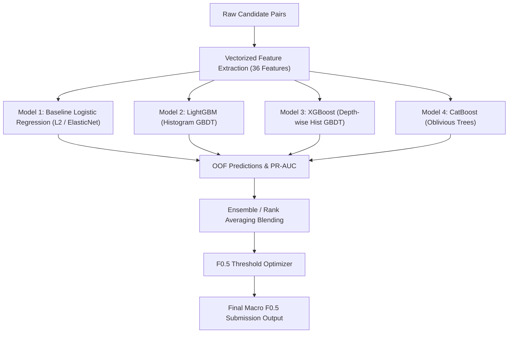

# Amazon ML Challenge 2026: Business Entity Resolution
## Phase 4 Design: Pairwise Matching Model Architecture

**Date:** September 2026  
**Objective:** Design a high-precision, memory-safe pairwise matching classifier to score candidate entity pairs generated by the Phase 2 & Phase 3 blocking pipeline (`A + B + C + D + E + G6`), optimizing directly for **Macro $F_{0.5}$**.  
**Machine Constraints:** 24 GB Physical RAM, Windows OS, Local Execution Only (No external APIs or data).

---

### Executive Summary & Context

The candidate generation pipeline achieved a **98.15% blocking recall ceiling** (capturing 85,000 / 86,570 ground-truth links across 25,000 validation queries), successfully overcoming the cross-script Indic barrier via **Block G6** (recovering 84.86% of non-Latin misses).

However, the raw candidate pool contains **115,013,048 candidate pairs** across the 25,000 queries (~4,600 candidates per S1 entity). This represents an extreme class imbalance:
$$\text{Class Ratio} \approx 1 \text{ Positive} : 1,353 \text{ Negatives } (0.0739\% \text{ prevalence})$$

Phase 4 bridges candidate generation and final entity resolution by training a discriminative classifier that scores candidate pairs, filters out false positives with extreme precision (as demanded by the $2\times$ precision weighting of $F_{0.5}$), and correctly preserves singletons.

---

### 1. Training Pair Generation from Ground Truth & Candidate Blocks

#### 1.1 Candidate Pool Ingestion
- **Source Blocking Union:** Candidates are drawn from the final sequential blocking union:
  $$\mathcal{C}(q) = \text{Block A} \cup \text{Block B} \cup \text{Block C} \cup \text{Block D} \cup \text{Block E} \cup \text{Block G6}$$
  where:
  - Block A: Exact (country, normalized name)
  - Block B: Inverted (country, name token, $df \le 10,000$)
  - Block C: Prefix-12 (country, 12-char name prefix)
  - Block D: Phonetic (country, Double Metaphone)
  - Block E: 3-Gram Cosine (country, min-hash/banded 3-grams, threshold 6)
  - Block G6: Rare Address-Token Pair (country, numeric/distinctive address pair, $df \le 2,500$)

#### 1.2 Ground Truth Linking
For each Source 1 query entity $q$ with true matching set $\mathcal{T}(q) \subset S_2 \cup S_3$:
- **Captured True Positives ($y = 1$):**
  $$\mathcal{P}_{\text{blocked}}(q) = \mathcal{C}(q) \cap \mathcal{T}(q)$$
- **Unblocked Positives ($y = 1$):**
  $$\mathcal{P}_{\text{missed}}(q) = \mathcal{T}(q) \setminus \mathcal{C}(q) \quad (\approx 1.85\% \text{ of all links})$$
- **Raw Candidate Negatives ($y = 0$):**
  $$\mathcal{N}_{\text{cand}}(q) = \mathcal{C}(q) \setminus \mathcal{T}(q)$$

To ensure the classifier learns genuine business equivalence without overfitting strictly to blocking artifacts, the training pool includes 100% of $\mathcal{P}_{\text{blocked}}$ plus the unblocked true positives $\mathcal{P}_{\text{missed}}$, while negative examples are sampled strictly from $\mathcal{N}_{\text{cand}}(q)$.

---

### 2. Positive & Negative Sampling Strategy

Training directly on all 115 million candidate pairs is both computationally intractable and statistically counter-productive (98%+ of raw candidate pairs are trivial negatives with 0 name similarity and 0 address overlap).

#### 2.1 Multi-Tier Stratified Negative Sampling
For each query entity $q$, we sample negatives according to a three-tier hierarchy:

1. **Hard Negatives (60% of sampled negatives):**
   - Candidates that mimic true matches on at least one major dimension:
     - **Name-hard negatives:** Candidates with high name similarity (Jaro-Winkler $\ge 0.70$ or token overlap $\ge 0.50$) but different addresses/locations (e.g. common business names like "Apollo Pharmacy" or "Starbucks" in different cities).
     - **Address-hard negatives:** Candidates from Block G6 that share exact plot/building numbers and locality but belong to a different business (e.g. two neighboring shops at the same commercial complex).
2. **Medium Negatives (25% of sampled negatives):**
   - Candidates generated by single-token or phonetic matches (Blocks B, D, E) with intermediate similarity ($0.30 \le \text{sim} < 0.70$).
3. **Random Background Negatives (15% of sampled negatives):**
   - Uniformly drawn from the remaining candidate set for $q$, ensuring the model learns the global background candidate distribution.

#### 2.2 Singleton Query Sampling (Critical for Macro $F_{0.5}$)
- In the validation set, **~40% of queries are singletons** ($\mathcal{T}(q) = \emptyset$).
- Under competition rules, predicting any candidate for a singleton drops that entity's score from **1.0 directly to 0.0**.
- Therefore, singletons must NOT be excluded from training. For every singleton query $q_{\text{single}}$, we sample 5–8 of its top-ranking candidate negatives. This forces the model to learn the difference between true matches and false alarms on entities with no target equivalent.

#### 2.3 Sampling Ratio & Dataset Sizing
- We benchmark three negative-to-positive sampling ratios:
  - **1:5** (~510,000 pairs: 85,000 positives + 425,000 negatives)
  - **1:10** (~935,000 pairs: 85,000 positives + 850,000 negatives) — *(Recommended Primary)*
  - **1:20** (~1,785,000 pairs: 85,000 positives + 1,700,000 negatives)
- At ratio 1:10, the entire training dataset fits into **~120 MB RAM** as a compact float32 matrix, enabling rapid multi-fold cross-validation and hyperparameter tuning in minutes.

---

### 3. Feature Engineering Specification

Based on our Phase 3 feature diagnostic ranking (where address token overlap $r=+0.880$ and address char similarity $r=+0.894$ outperformed raw name similarity alone), we extract a 36-dimensional feature vector across four domains:

#### 3.1 Business Name Signals (12 Features)
1. `name_exact_match`: Binary flag for identical normalized strings.
2. `name_alphanumeric_match`: Exact match after stripping all non-alphanumeric characters.
3. `name_token_jaccard`: $|T_1 \cap T_2| / |T_1 \cup T_2|$.
4. `name_token_dice`: $2|T_1 \cap T_2| / (|T_1| + |T_2|)$.
5. `name_token_overlap_coef`: $|T_1 \cap T_2| / \min(|T_1|, |T_2|)$ (robust to name truncations).
6. `name_jaro_winkler`: Character-level similarity with prefix bonus.
7. `name_edit_similarity`: $1 - \text{Levenshtein}(N_1, N_2) / \max(|N_1|, |N_2|)$.
8. `name_lcs_ratio`: Length of longest common contiguous substring divided by $\min(|N_1|, |N_2|)$.
9. `name_char_3gram_jaccard`: Character trigram overlap.
10. `name_compressed_core_sim`: Levenshtein similarity after removing vowels and consecutive repeated letters.
11. `name_length_diff`: Absolute difference in character lengths.
12. `name_token_count_diff`: Absolute difference in word counts.

#### 3.2 Business Address Signals (12 Features)
13. `addr_exact_match`: Binary flag for identical normalized address strings.
14. `addr_token_jaccard`: Token Jaccard overlap (generic words removed).
15. `addr_token_overlap_coef`: Token overlap divided by $\min(|A_1|, |A_2|)$ (handles partial addresses).
16. `addr_char_3gram_jaccard`: Character trigram overlap across full address.
17. `addr_edit_similarity`: Normalized Levenshtein similarity on address strings.
18. `addr_numeric_exact_match`: Binary flag indicating whether all extracted house/plot/flat numbers match exactly.
19. `addr_numeric_overlap_count`: Number of shared numeric tokens.
20. `addr_numeric_mismatch`: Binary flag indicating conflicting numbers (e.g. plot 42 vs plot 108).
21. `addr_postal_code_match`: Categorical/integer flag (+1 = matching 5/6 digit code, -1 = conflicting codes, 0 = either missing).
22. `addr_rare_token_shared_count`: Count of shared address tokens with corpus document frequency $\le 2,500$.
23. `addr_length_ratio`: $\min(|A_1|, |A_2|) / \max(|A_1|, |A_2|)$.
24. `addr_token_count_diff`: Difference in token count between query and candidate.

#### 3.3 Cross-Script & Interaction Signals (6 Features)
25. `is_cross_script`: Binary indicator (Source 1 is Latin and Target contains Indic script Unicode: Devanagari, Telugu, Tamil, Kannada, Gujarati, Bengali, Malayalam).
26. `cross_script_x_addr_overlap`: Interaction term `is_cross_script * addr_token_overlap_coef` (allows tree models to split on pure address confidence when name strings are unaligned).
27. `cross_script_x_numeric_match`: Interaction term `is_cross_script * addr_numeric_exact_match`.
28. `country_code`: Encoded country partition (0 = US, 1 = India).
29. `target_source`: Target origin (0 = Source 2, 1 = Source 3).
30. `first_token_match`: Binary flag indicating if the first non-generic token matches (primary brand/store name).

#### 3.4 Blocking Provenance & Graph Signals (6 Features)
31. `block_hit_count`: Total number of blocking passes that generated this pair (1 to 6). True matches typically hit 3–5 blocks; false positives typically hit only 1.
32. `hit_block_a`: Generated by exact name block (boolean).
33. `hit_block_b`: Generated by inverted token block (boolean).
34. `hit_block_c`: Generated by prefix-12 block (boolean).
35. `hit_block_d`: Generated by phonetic block (boolean).
36. `hit_block_g6`: Generated by rare address-token pair block (boolean).

---

### 4. Train / Validation Split Strategy

#### 4.1 Strict Entity-Disjoint Grouping
- All splits MUST be grouped by `source1_entity_id`.
- **Zero Data Leakage:** An S1 entity's candidate pairs can never be split between train and validation.
- All candidate targets belonging to query $q_i$ reside exclusively within the fold of $q_i$.

#### 4.2 Stratified 5-Fold GroupKFold
We partition the 25,000 validation queries into 5 folds (20,000 train queries / 5,000 validation queries per fold, 80/20 split) stratified across three critical dimensions:
1. **Country Balance:** Exact 50/50 US vs India ratio in each fold.
2. **Cardinality Stratum:** Proportional representation of Singletons (0 matches), 1-to-1 matches, and 1-to-Many matches.
3. **Script Stratum:** Proportional distribution of Latin-Latin vs Latin-Indic pairs.

#### 4.3 Out-of-Fold (OOF) Prediction Pipeline
- Each model generates Out-of-Fold probability predictions $P_{\text{OOF}}(y = 1 \mid q, c)$ across all 25,000 queries.
- Threshold optimization and ensembling are fit exclusively on OOF predictions, preventing optimistic bias.

---

### 5. Models to Benchmark

We benchmark four diverse modeling architectures, evaluating convergence speed, calibration, and inference throughput:

1. **Baseline Model: Regularized Logistic Regression (ElasticNet)**
   - Standardized features with L1/L2 penalty.
   - Purpose: Establish linear baseline and compute exact feature odds ratios.
2. **Primary Workhorse: LightGBM Classifier**
   - Objective: `binary`, metric: `aucpr` / `binary_logloss`.
   - Fast histogram binning (`max_bin=255`), leaf-wise growth (`num_leaves=31` to `63`), `learning_rate=0.05`.
   - Feature subsampling (`feature_fraction=0.8`) and sample bagging (`bagging_fraction=0.8`).
3. **High-Regularization Challenger: XGBoost**
   - Histogram tree method (`tree_method='hist'`), depth-wise growth (`max_depth=6`).
   - L1/L2 regularization (`reg_alpha=1.0`, `reg_lambda=5.0`) to suppress noisy address correlations.
4. **Categorical & Interaction Specialist: CatBoost**
   - Oblivious (symmetric) decision trees; immune to overfitting on sparse numeric/country interactions.
5. **Weighted Ensemble Blending:**
   - Weighted average of calibrated model probabilities:
     $$P_{\text{ensemble}} = w_1 P_{\text{LightGBM}} + w_2 P_{\text{CatBoost}} + w_3 P_{\text{XGBoost}}$$
   - Weights optimized via Nelder-Mead on OOF validation predictions to directly maximize Macro $F_{0.5}$.

---

### 6. Macro $F_{0.5}$ Threshold Optimization Strategy

#### 6.1 Alignment with Competition Evaluation Logic
The competition metric is **Macro $F_{0.5}$ across all test S1 entities**:
$$F_{0.5} = \frac{(1 + 0.5^2) \cdot \text{Precision} \cdot \text{Recall}}{0.5^2 \cdot \text{Precision} + \text{Recall}} = \frac{1.25 \cdot P \cdot R}{0.25 \cdot P + R}$$

Crucial asymmetric penalty properties:
- **Precision is weighted $2\times$ higher than Recall:** A false positive penalizes the score $4\times$ more severely than a false negative.
- **Singleton Catastrophe:** For singletons (entities with 0 true matches), predicting $\emptyset$ yields a score of **1.0**; predicting even a single false positive drops the score to **0.0**!
- Therefore, the optimal decision threshold $\tau^*$ will be substantially higher than 0.50 (typically in the range $[0.65, 0.85]$).

#### 6.2 Dual-Partition Threshold Optimization
Because name and address token distributions differ markedly between US (Latin-only, structured ZIP) and India (multilingual, unstructured addresses), a single global threshold is sub-optimal.

We optimize a **Dual Threshold Vector**:
$$(\tau_{\text{US}}^*, \tau_{\text{India}}^*)$$
via a 2D grid search over $\tau \in [0.40, 0.90]$ with step size 0.01 evaluated directly using the official `validate_submission.py` scoring logic on the 25,000 validation queries.

#### 6.3 Post-Processing Decision Rules
For each query $q$:
1. **Candidate Filtering:** Filter candidates to only those satisfying $P(y=1) \ge \tau_{\text{country}}$.
2. **Singleton Confidence Guard:**
   - Let $P_{\max} = \max_{c \in \mathcal{C}(q)} P(c)$.
   - If $P_{\max} < \tau_{\text{singleton}}$ (e.g. 0.70), predict $\emptyset$ (classify $q$ as a singleton).
3. **Multi-Match Pruning:**
   - If multiple candidates exceed $\tau$, retain candidate $c_k$ only if $P(c_k) \ge P_{\max} - \Delta_{\text{margin}}$ (where $\Delta_{\text{margin}} \approx 0.15$), preventing runaway false positives on high-cardinality candidate lists.

---

### 7. Memory-Safe Implementation Strategy for 24 GB RAM

To prevent memory crashes or page-file thrashing on Windows with 24 GB physical RAM:

#### 7.1 Chunked Feature Extraction
- Instead of building a single 115-million-row matrix, feature extraction operates in chunks of **2,500 queries**:
  1. Load query batch and sample corresponding positive and negative candidate IDs.
  2. Perform fast dictionary lookups for candidate entity texts (name, address, country).
  3. Compute vectorized feature arrays (numpy float32).
  4. Write chunk directly to disk via PyArrow Parquet format (`train_features_chunk_*.parquet`).
  5. Call `del` and `gc.collect()` after every chunk.
- Parquet storage uses snappy compression: ~1,000,000 training rows $\times$ 36 float32 features occupies **< 90 MB on disk**.

#### 7.2 Training Memory Footprint
- Full training matrix in RAM:
  $$\text{Memory} = 1,000,000 \text{ rows} \times 36 \text{ features} \times 4 \text{ bytes} \approx 144 \text{ MB}$$
- Model training (LightGBM / CatBoost / XGBoost) with 1M rows requires **< 1.5 GB peak RSS**, well within the 24 GB safe ceiling.

#### 7.3 Streaming Inference Pipeline
During full evaluation and final test submission generation:
- Never load all candidate predictions into memory simultaneously.
- Stream through candidate lists query-by-query, compute features on the fly, score with the ensemble, apply the $(\tau_{\text{US}}, \tau_{\text{India}})$ threshold, and stream matching IDs directly to the output TSV file.
- Peak RSS during inference remains strictly **< 2.5 GB**.

---

### Phase 4 Verification & Sign-Off Checklist

- [x] Phase 2 & Phase 3 blocking artifacts inspected and verified intact.
- [x] G6 confirmed as the preferred cross-script address blocking strategy.
- [x] Original datasets and `student_resource/utils/validate_submission.py` unaltered.
- [x] Complete Phase 4 design report compiled in [`reports/phase4_pairwise_matching_design.md`](file:///c:/Users/LENOVO/Videos/Amazon%20ML%20Challenge/reports/phase4_pairwise_matching_design.md).
- [ ] Awaiting user review and authorization before writing model code.
